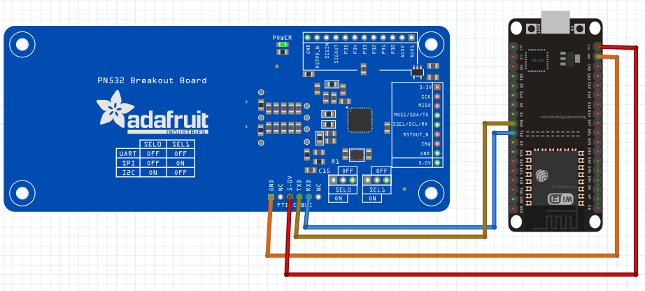

# GET-SERIAL-ESP32-PN532-SPI
Contoh membaca serial kartu menggunakan eps32 mengunakan reader pn532

## Peralatan yang dibutuhkan adalah
1. Eps32
2. Reader pn532
3. Smart card 
4. [Library PN532](https://github.com/elechouse/PN532)

## Schematic
<figure style="text-align: center">
                  
                  <figcaption style="text-align: center; font-weight: bold">Schematic</figcaption>
              </figure>
